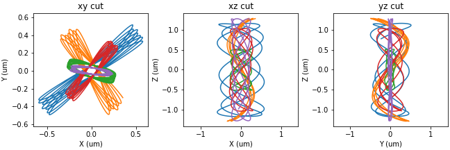

# atomic-dynamics

Atomic dynamics simulation package developed during my PhD to run simulations and analyze experimental data. It provides functions to simulate classical dynamics of atoms in various trapping potentials, involving either the attractive dipole force or the repulsive ponderomotive force. It also allows for the computation of related observables such as light shifts and coherence loss.

The concepts involved are quite specialized. Some relevant explanations can be found in [my thesis](https://theses.hal.science/tel-04551702), more specifically in appendix D.

More precisely, the package implements:
* Potential computations utilities.
    - Evaluation of non-analytical trapping potentials on a mesh grid
    - Convolution with a charge density (ponderomotive force)
* Sampling of atomic positions and momenta at thermal equilibrium in arbitrary
  potentials.
* Integration of the equations of motion for many atoms at once.
* Simulation of experimental sequences and determination of macroscopic
  observables.
  - Arbitrary sequences
  - Pre-determined sequences
* Many examples to illustrate what is possible with the package.

The code was written while I was rushing to finish writting my thesis. Although it works and is provided with many examples, the structure is inelegant and the code is severely lacking documentation. In other words, this code needs a complete refactoring.

I do not maintain it anymore.

<p align="center">
    
</p>


## Usage

Setup the Python environment to run the examples.
- With `pip`,
  ```bash
  pip install -r requirements.txt
  ```
- Using `conda`,
  ```bash
  conda create --name <env_name> --file requirements.txt
  conda activate <env_name>
  ```
- Using `uv`,
  ```bash
  uv venv .venv
  source .venv/bin/activate   # On Windows: .venv\Scripts\activate
  uv pip install -r requirements.txt
  ```


## Notes

The typing annotations in the code are by no means rigorous. They are made to facilitate the understanding of the nature of various parameters.
